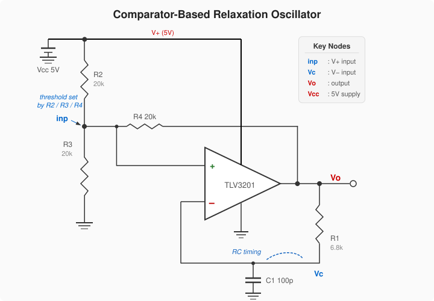
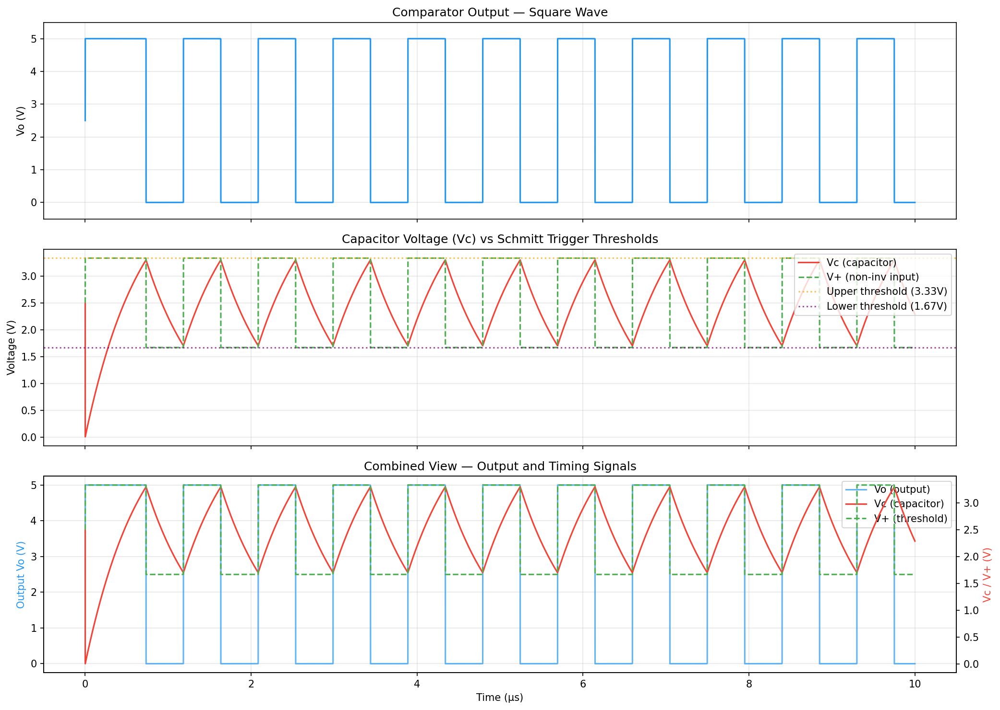

# neospice

[](https://github.com/razorback16/neospice/actions/workflows/ci.yml)
[](https://pypi.org/project/neospice/)
[](https://pypi.org/project/neospice/)

**[Open Circuit Lab →](https://razorback16.github.io/neospice/)** — build and simulate circuits in your browser. No installation required.

neospice is an independent C++20 reimplementation of the SPICE circuit simulator. Its solver, analysis flow, and device models derive from UC Berkeley SPICE3 (BSD-licensed) and ngspice -- re-architected around a clean Device interface, native Python bindings, and an embeddable C++ API. MIT licensed; see [NOTICE](NOTICE) for full third-party attribution.

It reads SPICE netlists, writes ngspice-format raw results, and pairs a self-contained Sparse 1.3-compatible solver stack and differentiated behavioral sources with an embeddable API for EDA tools, optimization loops, and notebooks.

Publication validation targets ngspice 47 exclusively. The current working tree retains an operating-point regression failure and corpus mismatches. See the [progress tracker](docs/joss-progress.md) and [comparison methods](docs/validation-methods.md). The project is not yet ready for a JOSS submission.

An initial [JOSS manuscript draft and PDF](paper/README.md) are available for
review. Actual research evidence, final validation/benchmarks and human
disclosures remain pending. [ngspice 47 compatibility](docs/ngspice47-reference.md)
defines the default behavior, required reference checks and migration-tool inputs.
A compiled draft is
not a submission-ready release.

## Features

- **Analyses** -- DC OP, DC sweep, transient (adaptive Trap/Gear-2/BE), AC small-signal, noise (adjoint method), transfer function, sensitivity, pole-zero, Fourier/THD, parameter sweep (`.step`), and `.measure` post-processing
- **Device families** -- passives, independent/dependent/behavioral sources, switches, transmission lines, diodes, BJTs, JFETs, MESFETs, HFETs, and MOSFETs through BSIM4v7
- **Embeddable C++ API** -- `Simulator`/`Circuit`/`Result` types with handle-based and string-based accessors, typed device methods, and circuit introspection
- **High performance** -- NeoSolver (self-contained Sparse 1.3-compatible LU), G/C matrix caching for AC, adjoint-method noise
- **ngspice-compatible** -- reads standard SPICE netlists, writes `.raw` files in ngspice format
- **C++ and Python validation** -- analytical checks and ngspice comparisons, with current failures and test results in the [progress tracker](docs/joss-progress.md)
- **Corpus harness** -- a historical cohort of **34,908 KiCad operating-point fixtures**; [input freezing](docs/kicad-experiment.md) now records declaration identities and separate planned rescues. Completed ngspice 47 audits are linked from the progress tracker; declaration binding and full-model scope still need interpretation. Minimal operating-point fixtures do not certify transient, AC, or noise behavior.

## Browser Circuit Lab

**[Launch Circuit Lab](https://razorback16.github.io/neospice/)**

Build and simulate circuits in a visual schematic editor, or use an editable
SPICE netlist. [Circuit Lab](docs/circuit-lab.md) includes eight interactive
examples, light/dark themes, DC/AC/transient plots, parameter tuning, local
project saving, and CSV export. The simulator runs entirely in your browser
using WebAssembly.

```sh
# Build the WASM artifacts first; see docs/webassembly.md.
npm --prefix web ci
npm --prefix web run build
npm --prefix web run preview
```

Open **http://127.0.0.1:48173/**. The [Circuit Lab guide](docs/circuit-lab.md)
covers the visual editor, external preview tunnel, tests and manual GitHub Pages
deployment. The existing minimal WASM demo is also retained.

## Quick Start (C++)

### Prerequisites

- C++20 compiler (GCC 12+ or Clang 15+)
- CMake 3.20+
- OpenBLAS
- SLEEF (vectorized math library)

See [docs/building.md](docs/building.md) for platform-specific install commands.

### Build

```bash
cmake -B build -DCMAKE_BUILD_TYPE=Release
cmake --build build -j$(nproc)
```

### Run

```bash
# Simulate a netlist
./build/neospice circuit.cir

# Specify output file
./build/neospice circuit.cir -o result.raw

# Split output by analysis type
./build/neospice circuit.cir --split
```

Output is written in ngspice-compatible `.raw` format, viewable in any waveform viewer (e.g. GTKWave, KST, ngspice's built-in plot).

### Test

```bash
cd build && ctest -j$(nproc)
```

## Analyses

| Analysis | Netlist Command | Description |
|---|---|---|
| DC operating point | `.op` | Newton-Raphson with GMIN/source stepping fallback |
| DC sweep | `.dc V1 0 5 0.1` | 1D and nested 2D parameter sweeps |
| Transient | `.tran 1n 100n` | Adaptive timestepping with LTE control |
| AC small-signal | `.ac dec 10 1 100meg` | DEC/OCT/LIN frequency sweeps |
| Noise | `.noise v(out) V1 dec 10 1 100meg` | Adjoint method, per-device breakdown |
| Transfer function | `.tf v(out) V1` | Gain + input/output impedance |
| Sensitivity | `.sens v(out)` | Finite-difference DC sensitivity to resistor values and independent-source DC values |
| Pole-zero | `.pz` | Transfer function poles and zeros |
| Fourier | `.four 1meg v(out)` | Harmonic decomposition + THD |
| Parameter sweep | `.step param R1 1k 10k 1k` | Sweep any parameter across analyses |

## Device Models

AM source parameters now follow ngspice 47. Existing AM netlists and C++ source
parameters may require conversion; see [source compatibility](docs/source-compatibility.md).

| Category | Models |
|---|---|
| Passives | R (with TC, AC resistance, flicker/thermal noise), C, L, K (mutual inductance) |
| Sources | V, I -- DC, PULSE, SIN, PWL, EXP, SFFM, AM waveforms |
| Dependent sources | E (VCVS), G (VCCS), F (CCCS), H (CCVS) -- linear, POLY, TABLE |
| Behavioral | B-source -- expression-based with auto-diff Jacobians, DDT, IDT, PWL, TABLE |
| Switches | S (voltage-controlled), W (current-controlled) -- hysteresis |
| Transmission lines | T (lossless Branin), O (LTRA lossy -- RC/RG/LC/RLC) |
| Diode | Standard diode (level 1) |
| BJT | Gummel-Poon, VBIC (levels 4/9/12/13) |
| JFET | JFET (Shichman-Hodges), JFET2 (Parker-Skellern) |
| MESFET | MES (GaAs MESFET -- NMF/PMF) |
| HFET | HFET1 (Curtice Cubic), HFET2 (Chalmers) |
| MOSFET | MOS1, MOS3, MOS9, BSIM3v32, BSIM3, BSIM4v7, BSIMSOI, HiSIM2, HiSIM_HV |

## C++ API

### Running a netlist

```cpp
#include "neospice/neospice.hpp"

neospice::Simulator sim;
auto ckt = sim.load("amplifier.cir");
auto result = sim.run(ckt);

// Typed access to results
auto& ac = std::get<neospice::ACResult>(result.analysis);
auto gain_db = ac.magnitude_db("out");
auto phase = ac.phase_deg("out");
```

### Individual analyses

```cpp
auto dc = sim.run_dc(ckt);
double vout = dc.voltage("out");

auto tran = sim.run_transient(ckt, 1e-9, 1e-6);
auto vout_wave = tran.voltage("out");   // vector<double>

auto ac = sim.run_ac(ckt, neospice::ACMode::DEC, 10, 1.0, 100e6);
auto gain = ac.magnitude_db("out");     // vector<double>
```

### Building circuits programmatically

```cpp
using namespace neospice;

Circuit ckt;
auto in  = ckt.node("in");
auto out = ckt.node("out");

ckt.V("V1", in, GND, 0.0, 1.0);  // DC=0, AC=1
ckt.R("R1", in, out, 1e3);
ckt.C("C1", out, GND, 100e-12);

Simulator sim;
auto ac = sim.run_ac(ckt, ACMode::DEC, 10, 1.0, 100e6);
auto gain = ac.magnitude_db("out");
```

### Handle-based result access

```cpp
// String-based (works with any circuit)
double vout = dc.voltage("out");

// Handle-based (O(1) dense array access, type-safe)
NodeId out_id = ckt.find_node("out");
double vout_h = dc.voltage(out_id);
auto vout_ac  = ac.magnitude_db(out_id);
```

### Measurement utilities

```cpp
#include "neospice/measure.hpp"

NodeId out_id = ckt.find_node("out");
double bw     = measure::bandwidth_3db(ac, out_id);
double rt     = measure::rise_time(tran, out_id, 0.5, 4.5);
double st     = measure::settling_time(tran, out_id, 5.0, 0.05);
double vrms   = measure::rms(tran, out_id);
```

### Circuit introspection

```cpp
auto nodes   = ckt.node_names();            // {"in", "out", ...}
auto devices = ckt.device_names();          // {"R1", "C1", "V1"}
auto info    = ckt.device_info("R1");       // type, nodes, value
auto conn    = ckt.devices_at_node("out");  // {"R1", "C1"}

// Handle-based introspection
NodeId nid   = ckt.find_node("out");
DevId  did   = ckt.find_device("R1");
auto   name  = ckt.name(nid);              // "out"
auto   dinfo = ckt.device_info(did);       // DeviceInfo struct
```

## Python

```bash
pip install neospice
```

Prebuilt wheels are published for **CPython 3.10–3.14** on Linux (x86_64, aarch64) and macOS Apple Silicon (arm64). On other platforms pip builds from the source distribution, which needs a C++20 compiler plus OpenBLAS and SLEEF.

```python
import neospice as ns
import matplotlib.pyplot as plt

# One-liner convenience functions
dc = ns.dc("amplifier.cir")
print(dc.voltage("out"))

ac = ns.ac("filter.cir", mode="dec", npoints=100, fstart=1, fstop=1e9)
plt.semilogx(ac.frequency, ac.magnitude_db("out"))

tran = ns.transient("osc.cir", tstep=1e-9, tstop=1e-6)
plt.plot(tran.time, tran.voltage("out"))

# Parse inline netlists directly
dc = ns.dc("Divider\nV1 in 0 DC 10\nR1 in mid 1k\nR2 mid 0 1k\n.op\n.end\n")
print(dc.voltage("mid"))  # 5.0

# Or use the full Simulator API
sim = ns.Simulator()
ckt = sim.load("amplifier.cir")          # from file
ckt = sim.parse("...\n.op\n.end\n")      # or from string
result = sim.run_ac(ckt, ns.ACMode.DEC, 100, 1, 1e9)

# Build circuits programmatically with typed methods
ckt = ns.Circuit()
ckt.V("V1", "in", "0", 0.0, 1.0)        # DC=0, AC=1
ckt.R("R1", "in", "out", 1e3)
ckt.C("C1", "out", "0", 100e-12)

# SPICE engineering notation
from neospice import parse_value
r = parse_value("4.7k")                  # 4700.0
```

All result vectors are returned as NumPy arrays.

## Browser simulation

Build `neospice.wasm` and its JavaScript module with Emscripten. The included
Worker demo supports netlist editing, DC/AC/transient simulation and resistor
sliders. [Build instructions, JS/TypeScript API and limits](docs/webassembly.md).

## Gradients and interactive updates

Use `Simulator.sensitivity()` for DC adjoint Jacobians and `sensitivity_ac()`
for linear-circuit complex AC gradients. [Supported parameters and examples](docs/adjoint-gradients.md).
For repeated component changes, `Circuit.update_param()` with `re_solve()` or
`re_solve_ac()` reuses per-circuit symbolic factorization. [Incremental workflow](docs/incremental-simulation.md).

## Parallel parameter studies

Run independent parameter corners with `neospice.sweep()` or seeded variations
with `neospice.monte_carlo()`. The C++ API provides `Simulator::run_sweep()` and
`Simulator::monte_carlo()`. Results preserve job order and report per-job errors.
See [parallel studies](docs/parallel-studies.md) for examples, correlation,
statistics, reproducibility and concurrency limits.

## Performance

The paired benchmark covers 34 fixed workloads: small circuits, amplifier
macromodels, larger resistor meshes and diode ladders, and RC/diode-RC analyses.
Every accepted timing requires valid, accuracy-qualified results from both
engines. The protocol records load, analysis/result materialization, cleanup
and total time with equal sampling and alternating execution order.

See [benchmark methods](docs/benchmark-methods.md) for reproduction and
[the progress tracker](docs/joss-progress.md) for completed evidence and active
runs. Historical timings from the former harness are
[archived](docs/evidence/joss/2026-09-11-historical-readme-performance.md); they
lack the corrected qualification protocol and must not support performance
claims. [Performance analysis](docs/performance-analysis.md) explains the limits.

## Netlist Compatibility

Beyond core devices and analyses, neospice handles the usual deck directives and syntax:

- `.param` expressions with arithmetic, functions (`sqrt`, `log`, `exp`, `sin`, `if`, ...)
- `.subckt` / `.ends` with parameter defaults (recursion limit 100)
- `.include` / `.lib` with section selection and circular-inclusion detection
- `.global`, `.ic`, `.nodeset`, `.options`, `.func`, `.save`
- SPICE suffixes: `T`, `G`, `MEG`, `k`, `m`, `u`, `n`, `p`, `f`

## Project Structure

```
cli/            Command-line interface
include/
  neospice/     Public API headers (types.hpp, neospice.hpp, measure.hpp)
src/
  api/          C++ API (Simulator, typed device methods, measurement utils)
  core/         Analysis engines and linear solvers
  devices/      32 device models, each self-contained with factory registration
  parser/       Netlist parser and expression evaluator
  output/       Raw file writer
python/
  bindings.cpp  nanobind C++ → Python bridge
  neospice/     Python package (convenience API, SPICE notation parser)
tests/
  unit/         Unit tests for all components (970+)
  devices/      Per-device validation against ngspice
  circuits/     Integration test netlists
  python/       Python binding tests
  bench/        Performance benchmarks
docs/           Architecture, performance, and design documentation
tools/          Device migration tooling (ngspice model auto-porter)
```

## Examples

### Comparator Relaxation Oscillator

A TLV3201-based Schmitt trigger oscillator simulated with the Python API. [Comparator relaxation oscillator](examples/rc_relaxation_oscillator/rc_relaxation_oscillator.ipynb).





## Contributing

See [docs/building.md](docs/building.md) for platform-specific setup instructions, including building libngspice from source on macOS.

## Documentation

- [Performance comparison with ngspice](docs/performance-comparison-with-ngspice.md)
- [Algorithmic differences from ngspice](docs/neospice-vs-ngspice.md)
- [Device migration status](docs/device-migration-status.md)
- [Capabilities overview](docs/capabilities.md)
- [Architecture and design](docs/neospice-design.md)

## Roadmap

| Phase | Feature | Status |
|---|---|---|
| — | Handle-based API redesign (NodeId/DevId, typed methods, dense results, measurements) | **Done** |
| 1 | Python bindings (nanobind, PyPI wheels, typed construction) | **Done** |
| 2 | Parallel parameter sweeps / Monte Carlo | **Implemented** — [API and limits](docs/parallel-studies.md) |
| 3 | WebAssembly build for browser simulation | **Implemented** — [build and browser API](docs/webassembly.md) |
| 4 | Adjoint sensitivity / gradient computation | **Initial API implemented** — [scope](docs/adjoint-gradients.md) |
| 5 | Incremental re-simulation | **Initial API implemented** — [scope](docs/incremental-simulation.md) |
| 6 | GPU-accelerated simulation (CUDA) | Planned |
| 7 | Extended devices (BSIM-CMG, legacy MOS) | Ongoing |
| 8 | PWL (piecewise-linear) simulation for switching converters | Planned |
| 9 | Digital event simulation | Planned |
| 10 | Mixed-signal co-simulation | Planned |
| 11 | Verilog-A device models (syntax not yet supported) | Planned |
| 12 | ML-guided DC convergence — learned initial-guess predictor (GNN) to seed Newton | Research |

See [docs/ROADMAP.md](docs/ROADMAP.md) for details.

## Credits & SPICE lineage

neospice descends from the Berkeley SPICE family. It is an independent C++20 reimplementation, but its solver, analysis flow, and device models are derived — in many places translated — from UC Berkeley SPICE3 and ngspice. We gratefully acknowledge that lineage:

- L. W. Nagel and D. O. Pederson, "SPICE (Simulation Program with Integrated Circuit Emphasis)," Memorandum No. ERL-M382, UC Berkeley, April 1973.
- L. W. Nagel, "SPICE2: A Computer Program to Simulate Semiconductor Circuits," Memorandum No. ERL-M520, UC Berkeley, May 1975.
- SPICE2G6 (1983) — the Fortran reference release.
- SPICE3F5 (UC Berkeley, 1990s) — the BSD-licensed C rewrite that neospice's core and device code is translated from.
- [ngspice](https://ngspice.sourceforge.io/) — the maintained SPICE3F5 descendant, used as the reference/ground-truth implementation that neospice is validated against.

The NeoSolver sparse-LU stack derives from Kenneth Kundert's Sparse 1.3 (UC Berkeley). The separate in-tree minimum-degree ordering explicitly maintains the elimination graph and uses the default dense-vertex threshold from [SuiteSparse AMD](https://github.com/DrTimothyAldenDavis/SuiteSparse); it does not implement SuiteSparse AMD's quotient-graph algorithm.

Original project contributions use the MIT license. Derived SPICE code and device models retain applicable upstream notices and terms. See [NOTICE](NOTICE), [CREDITS.md](CREDITS.md), and the [distribution audit](docs/joss-attribution-audit.md).

The JOSS benchmark protocol and its current qualification failures are documented
in [paired benchmark methods](docs/benchmark-methods.md). Historical standalone
benchmark timings are not yet publication evidence.
